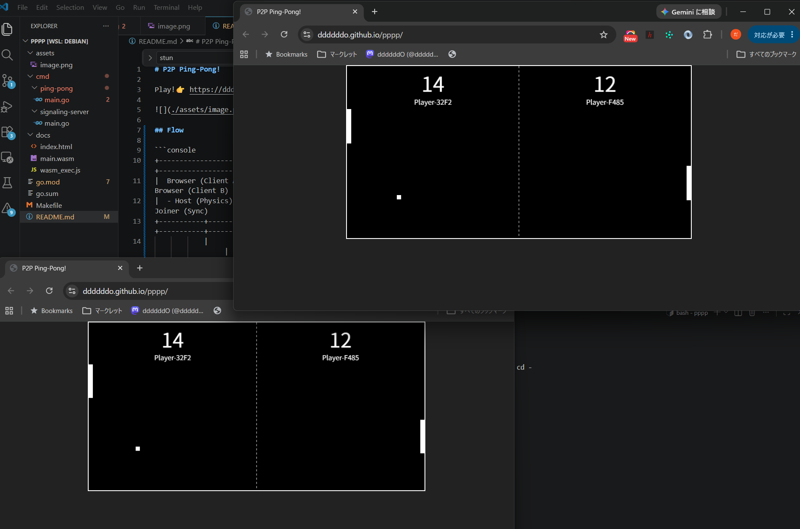

## P2P Ping-Pong!

Play!👉 https://ddddddo.github.io/pppp/

If two people connect, they can play a game of table tennis!



> [!TIP]
> If the game doesn't start even after both players have joined, try reloading the page a few times! (This is because the instance hosting the signaling server may be down and taking a while to start up.)

### Flow

```console
                       +--------------------------------+
                       | Static Web Host (GitHub Pages) |
                       +---------------+----------------+
                                       |
                           1. Download WASM (HTTPS)
                                       |
           +---------------------------+---------------------------+
           |                                                       |
           v                                                       v
+--------------------+                                    +--------------------+
| Browser (Client A) |                                    | Browser (Client B) |
+--+-------+---------+                                    +---------+-------+--+
   |       |                                                        |       |
   |       |          2. Matchmaking & Connection (wss://)          |       |
   |       +----------------> [ Signaling Server ] <----------------+       |
   |                            (Render.com)                                |
   |                                                                        |
   |                  3. Discover Public IP/Port (UDP)                      |
   +------------------------> [   STUN Server    ] <------------------------+
   |                            (Google STUN)                               |
   |                                                                        |
   |                  4. Exchange IP/Port Info (ICE Candidate)              |
   |   +--------------------> [ Signaling Server ] -------------------+     |
   |   |                        (Render.com)                          |     |
   |   +<-------------------------------------------------------------+     |
   |                                                                        |
   |                  5. Direct P2P Game Data (WebRTC)                      |
   +========================================================================+
```

1. ゲーム本体（WASM）のダウンロード
1. マッチングとシグナリング接続の確立
1. 自分のパブリックIP・ポート番号の確認

    各ブラウザが自動的に STUN サーバーに問い合わせる

1. IP・ポート情報（ICE Candidate / SDP）の交換

    3で判明した自分のパブリックIP・ポート番号や通信設定（SDP / ICE Candidate）を、シグナリングサーバーをバケツリレーして相手のブラウザに届ける（WebSocket経由）

1. WebRTC による P2P 直接通信の開始 

    お互いのIPアドレスとポート番号が揃ったため、ブラウザ同士が直接トンネル（DataChannel）を繋ぐ。ここから先は Render.com や Google のサーバーを一切通さず、パドル位置やボール座標などのゲームデータを直接やり取りする（P2P）

## ppChat

### Installation
```console
go install github.com/ddddddO/pppp/cmd/ppchat@latest
```

- Host

```console
ppchat -room test-room1 -role host
```

- Guest

```console
ppchat -room test-room1 -role guest
```

### Flow

```console
                     ┌──────────────────────────┐
                     │     Signaling Server     │
                     │  (WebSocket / Room Mgmt) │
                     └──────────┬───┬───────────┘
                                │   │
                 ① Signaling    │   │ ① Signaling
              (Offer/Answer/ICE)│   │ (Offer/Answer/ICE)
                                ▼   ▼
┌──────────────────────┐                     ┌──────────────────────┐
│     ppchat (Host)    │                     │    ppchat (Guest)    │
│                      │                     │   (Auto-retry join)  │
└──────────┬───────────┘                     └───────────┬──────────┘
           │                                             │
           └─────────────── ② Direct P2P ───────────────┘
                      (WebRTC DataChannel)
                     [Encrypted Chat Data]
```

## Note
- https://dashboard.render.com/project